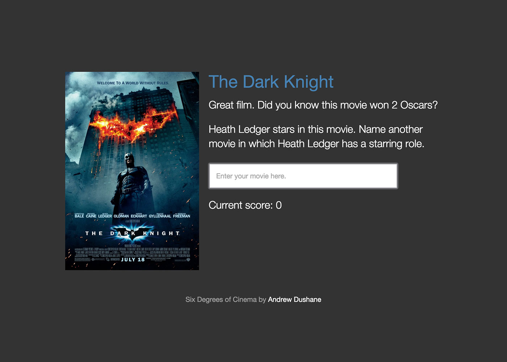

## Six Degrees of Cinema

### Browser-based, responsive movie trivia game

#### Dependencies
* jQuery
* [Velocity](http://julian.com/research/velocity/)
* Sinatra
* [OMDb API](http://omdbapi.com)

#### Description

Six Degrees of Cinema is a fun and simple movie trivia game. Name one of your favorite movies, and I'll give you an actor or actress that stars in it. You name another movie in which they’ve appeared (in a prominent or semi-prominent role), and you get a point. I give you another actor or actress from that movie, and you name another movie in which they’ve appeared… you get the idea.

This game can be played by one or two players. If you choose two-player mode, you and your competition will take turns naming movies for the actors I select.

#### Screenshot

#### Potential Upgrades
* Back button
* Pass button to get a different actor in easy mode
* Give option to select naming movies or naming actors
* Store full cast lists locally for better correctness checking
* Fetch, or store locally, actor images and show when prompting for a movie pick
